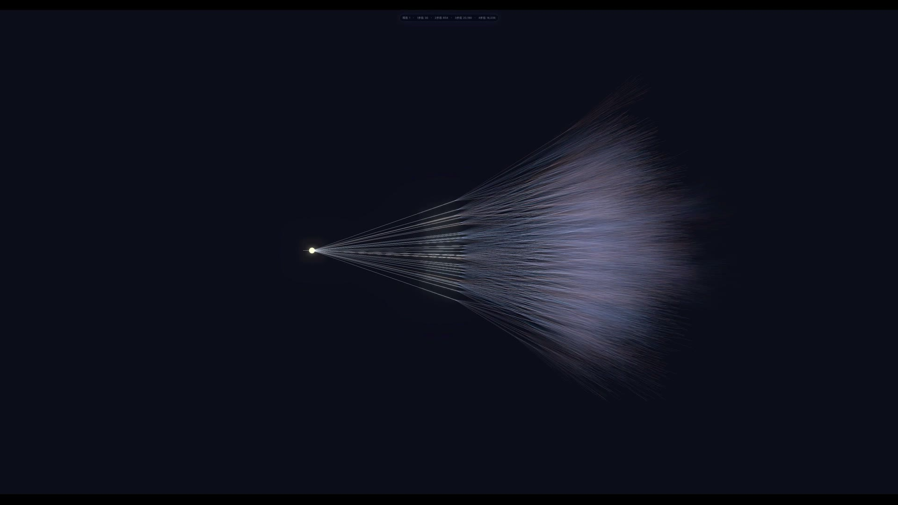

# 棋云 · 棋局未来地图（chess-cloud）

[](https://maxi-max-dev.github.io/chess-cloud/promo.html)

**▶ [观看 60 秒宣传片](https://maxi-max-dev.github.io/chess-cloud/promo.html)** · 走一步棋之前，看到所有可能的未来

一个产品，两套真实棋核，一张统一的棋局未来地图。首页先选**国际象棋**或**中国象棋**；进入后
都用同一套视觉与交互语言，一眼查看当前全部真实下一步。中国象棋会零点击选中分析主线并连续云演
默认 4 ply；两种棋都可在 1–10 ply 间选择预演深度，候选支持鼠标悬停或键盘聚焦后自动连演。点击仍用于明确选线或真正下棋，
两者都能看清吃子、将军、威胁与暴露等直接后果。

**在线入口**：https://maxi-max-dev.github.io/chess-cloud/

## 一个产品，两套规则

| 路径 | 内容 |
|---|---|
| `index.html` | 统一产品首页；选择国际象棋或中国象棋规则 |
| `chess.html` | 国际象棋规则与界面；棋子助手、3D 全景、2D 推演树、五列分叉和真实路线后果 |
| `xiangqi.html` | 中国象棋规则与界面；9×10 棋盘、3D 感全景、2D 推演树、可能回应、威胁和实战历史 |
| `future-map.css` | 两个棋种共用的产品壳、颜色角色、图例、路线语境栏和移动端规则 |

规则生成、评估和 Worker 各自独立；共用的是产品定位、视觉语法和同形的选路状态契约。灰色表示
其他合法路线，蓝色表示用户明确选择的条件路线，金色表示引擎分析建议或已验证 PV，白色表示实战历史，红色表示吃子 /
威胁等路线后果。

未来地图使用深空蓝紫底色，近层暖白、深层逐级沉入蓝紫；国际象棋的真实 `LineSegments` 使用
加法混合，让重叠密度自然成为亮度，并由单个选择性 bloom composer 只给线云与“现在”节点添一层
克制辉光，SAN 标签和页面 UI 不进入 WebGL 发光层。中国象棋在既有 SVG / CSS 全景中同步同一套
色彩层次，继续保持零 Three.js。国际象棋可用 `chess.html?cinema=1` 进入录屏影院模式：只保留
全屏星云与从 `__cloudStats()` 现读的层数行，不改变普通模式行为。

国际象棋云线在新几何抵达后的有限窗口内沿“现在 → 深处”流动；玩家落子时，旧未来会在 600ms 内
向选中的金色主线坍缩，AI 思考脉冲同时沿主线向前传导，搜索结束即停并从线末端长出新云。动画只改
共享 shader uniform，不逐帧改 geometry，也不进入路径计数；静置、切后台、离开视口或减少动态时
仍会彻底停帧。顶部层数只对真实计数做 300ms 字形揭示，不显示随机假数字。

双页棋子与推演细节也统一为有限动效：选中棋子只呼吸一个 2 秒周期；真实位移完成后才原子确认视觉
落点，再播放 400ms 涟漪，吃子额外碎成 10 粒并在 500ms 内清理。推演面板只在新一代内容建立时做
一次 200ms 扫描，悬停连演路径按 ply 逐段点亮。所有效果都不进入棋子 / 路径真值，减少动态保留
静态环与路线语义，稳定后仍回到零持续帧。

项目地基仍是：**所有显示出来的数字必须是真的**。合法着数、分叉数、棋子数和路径数都从当前局面
或真实渲染对象现读，再由独立验收重算；不能硬编码好看的答案，也不能把浅层排序说成概率。

## 主棋盘直接把路线演给你看

中国象棋首次加载或重置后会自动呈现全部真实候选，选中浅层分析主线，并按选择连续播放 1–10 ply
（默认 4 ply）；从 `autoplay_started` 到稳定局面硬限 8 秒，深线会自适应压缩每拍节奏。它不是预测：
金色表示引擎当前推荐优先检查的主线，不是对真人落子的概率；所有合法回应继续完整保留，用户随时可以暂停、继续、换线接管、退出或重置。
棋盘下方始终显示“采纳首步继续 / 返回棋盘自己下”，避免推演遮住真正下棋。页面隐藏或棋盘离开
视口时自动暂停，旧 run 的定时器和动画回调不能推进新局面。

国际象棋点击后仍维持显式选路：先播放用户选择的第一步，停住并列出对方全部真实回应，用户再点
某个回应才把它写成已选条件路线。若只是把鼠标停在任一候选上，或用键盘聚焦候选，则从该步开始
按所选深度自动接续一条 1–10 ply 浅层分析路线；每一步都从当时的新局面重新排序。移到另一候选会立即换线，移出后恢复真实棋盘，悬停路线不会写入
`selectedPath`。两页的预演都从当前 FEN 独立重放，不改实战记录；棋盘只读，只有“采纳首步继续 /
走这步”会真正提交第一步。减少动态模式不播放位移，直接显示相同的条件结果。触屏不启动悬停，
手机竖屏保留只读画中画棋盘与横滑回应条，画中画不会遮挡下面的分支触控。

## 国际象棋

点一枚白棋或点未来地图中的节点，只会建立预演路线，不会偷偷落子；“走这步”只提交用户选择的
第一步。首拍结束前，五列分叉、2D 树、变体棋盘和测试契约都不能绕过动画跳进第二拍。3D 全景
和 2D 推演树是同一份路线状态，切换视图不会丢掉已经选择的路线或走后局面。橙色虚线圈是几何攻击线，
候选卡另行说明落子后的一步合法吃子风险、能否回吃以及交换是否亏损。

桌面上可直接把鼠标停在五列卡片、2D 树节点、3D 标签或回应卡上看 1–10 ply 连演（默认 4）；键盘 Tab / 方向键
聚焦走同一协议。脚本恢复焦点、鼠标点击或触摸不会误触发连演。动画下方始终保留“返回棋盘自己下 /
采纳首步继续”，所以分析不会替代对局入口。

右侧五列分叉逐层列出真实合法走法。灰色是其他选择，蓝色是用户明确选择的路线；未选择时的金色
主干只是引擎建议，搜索完成后的金色虚线才表示从搜索源 FEN 逐手验证过的 PV。路线语境栏统一说明
这条路会吃子、将军、威胁或暴露什么。左上全景没有光点，每个未来节点只有一条真实父子线：

| 起始局面深度 | 路径数 |
|---|---:|
| 0 | 1 |
| 1 | 20 |
| 2 | 400 |
| 3 | 8,902 |
| 4 | 197,281 |

这些值不写在运行页面里。3D 网的路径数直接从非索引 `LineSegments` 的
`position.count / 2` 读取；2D 推演树的卡片数从 DOM 现数，每张“走后 N 个分支”再从该卡的真实
子局面生成合法着。缩略图只保留完整 L3，明确放大才在 cloud Worker 中计算 L4，收起立即释放；
静止后不持续请求动画帧或提交 WebGL。

国际象棋的 `engine.js` 是一套小型自写引擎：唯一评估函数、alpha-beta、迭代加深、时限和单条 PV。
AI 搜索在独立 Worker 中进行，主线程保留 watchdog 与合法 fallback，实际可见应手必须不超过 3 秒。
它不是职业棋力引擎；搜索仍不判三次重复、50 步和子力不足和棋，升变界面也暂时固定为后。

## 中国象棋

中国象棋不是国际象棋页面的皮肤。`xiangqi-engine.js` 独立实现 9×10 局面、FEN 往返、合法着生成、
将军过滤、将死/困毙、唯一评估函数、浅层候选排序、alpha-beta 搜索和 PV；规则覆盖：

- 将 / 帅九宫与将帅照面；
- 士九宫、象眼与不过河；
- 马腿、车直线、炮架；
- 兵 / 卒过河前后；
- 走后不能让己方被将。

起始局面的独立 perft 基线是：

| 深度 | 局面数 |
|---|---:|
| 1 | 44 |
| 2 | 1,920 |
| 3 | 79,666 |
| 4 | 3,290,240 |

页面会把当前全部合法下一步真实渲染出来。默认 2D 推演树逐条查看分叉，也可切到 3D 感全景，把
第一层全部真实路线放进同一视角；两种模式共用同一条预演与同一个走后局面。零点击云演自动选择
浅层排序第一名，并按 1–10 ply 选择器（默认 4）逐手重算后续推荐应对；所有黑方合法回应仍完整列出，换线会立即
接管并使旧 run 失效。路线语境栏在“运动完成原子提交 → 落点脉冲 → 威胁展开”的顺序中更新；只有
“采纳首步继续 / 走这步”或棋盘合法落点才真正改变实战 FEN。节点分叉数来自真实子局面，排序不是预测、历史胜率
或概率。

搜索、分叉排序与悬停连演使用三个 Worker 实例；悬停 Worker 可独立取消，换候选不会排在 44 分支
排序长任务后面。重开会终止旧实例，避免旧同步任务堵住新请求；Worker 故障
仍只能走预存的合法保底着，不能伪造已搜索主变。

棋盘采用现代木盘、炮兵位折角标和带倒角的象牙棋子；手机字号按棋子圆盘约束，667×375 横屏改为
紧凑双栏。每次真实落子都会短暂播放棋子从起点到终点的位移，随后持续保留空起点、金色轨迹、
落点和“上一步 · 行棋方 · 着法 · 坐标”文字，直到下一着替换。

威胁也不再只靠一个感叹号或同权 V 形箭头：朱红攻击流用“攻 → 危”明确方向，多名攻击者仍全部
保留，但一次只强调当前一条，其余降为背景线，并可用 `1/N` 按钮切换。新威胁只扫描 / 脉冲有限次，
随后静止；威胁条使用双方各自视角的中国象棋原生路数（如“黑炮2 → 红马八、红车九保护”），
不再把 `b7` 一类 ICCS 坐标暴露给普通玩家。`prefers-reduced-motion` 下完全停用动画但保留环、线、
端点和文字。它的语义仍然很窄：
切回普通动态也不会补播旧局面。它只表示**当前几何攻击线**，不是“下一手一定会被吃”，更不是概率。当前局面对象没有历史状态，
所以尚未实现长将、长捉和复杂循环裁决。中国象棋引擎也只是可解释、可验收的小型本地引擎，
不是职业级引擎。

## 文件

| 文件 | 职责 |
|---|---|
| `index.html` | 统一棋局未来地图的双规则入口 |
| `future-map.css` | 两页共用的产品壳、路线角色、图例、语境栏与响应式规则 |
| `chess.html` / `engine.js` / `worker.js` | 国际象棋 UI、唯一评估 / 搜索、AI、1–10 ply 推荐主线与 L1–L4 路径 Worker |
| `verify.mjs` / `live-check.mjs` / `self-play.mjs` | 国际象棋棋核、115 项真 Chrome、10 局稳定性验收 |
| `xiangqi.html` / `xiangqi-engine.js` / `xiangqi-worker.js` | 中国象棋 UI、规则 / 唯一评估 / 搜索、搜索与分叉 Worker |
| `xiangqi-verify.mjs` / `xiangqi-live-check.mjs` / `xiangqi-self-play.mjs` | 中国象棋棋核、71 项真 Chrome、固定 10 局稳定性验收 |
| `portal-check.mjs` | 首页、共享未来地图契约、两个规则入口和运行代码红线的 27 项静态验收 |
| `HANDOFF.md` / `BLOCKED.md` / `PROGRESS.md` | 自足交接、边界决策、迭代记录 |

没有构建工具、框架或后端；两套规则引擎保持独立，但通过 `future-map.css`、`[data-future-map]`
和同形的 `window.__futureTest` 组成一个产品。

## 本地运行与验收

```bash
npm install

# 快速、固定的棋核与路由裁判
npm test
# 国际象棋 8/8 + 中国象棋 20/20 + 统一门户 27/27

# 两套真 Chrome 验收
node live-check.mjs
node xiangqi-live-check.mjs

# bloom 的本机 GPU / 可见 Chrome 复核，以及可选截图存档
node live-check.mjs --headed --phase-one-only --shot .artifacts/chess.png
# 流动 / 坍缩 / 脉冲 / 重生的专项生命周期与关键帧复核
node live-check.mjs --headed --phase-two-only --shot .artifacts/chess-phase-2.png
# 棋子呼吸 / 落点涟漪 / 吃子碎裂 / 面板扫描 / 路径传导关键帧
node live-check.mjs --phase-three-only --shot .artifacts/chess-phase-3.png
node xiangqi-live-check.mjs --phase-three-only --shot .artifacts/xiangqi-phase-3.png
node xiangqi-live-check.mjs --shot .artifacts/xiangqi.png

# 两套固定 10 局稳定性审计；它们不是棋力基准
node self-play.mjs
node xiangqi-self-play.mjs
```

当前本地固定验收项数，以及本次 10 局实测记录：

- `npm test`：国际象棋 **8/8**、中国象棋 **20/20**、统一门户 **27/27**；
- `node live-check.mjs`：**115/115**；
- `node xiangqi-live-check.mjs`：**71/71**；
- `node self-play.mjs`：10 局、583 plies、543 次搜索；异常局、非法着、FEN、PV、注释失败全为 0；
- `node xiangqi-self-play.mjs`：10 局、833 plies、833 次搜索、1,550 个 PV 节点；
  `illegalMoves / fenMismatches / pvFailures / branchFailures / threatFailures` 全为 0。

自对弈固定的是局数、种子、单局上限和零错误断言；搜索采用墙钟预算，精确 plies / searches / PV
节点会随机器调度变化，以上数字是本次实测而不是写死期望。

`npm test` 不包含真 Chrome 和自对弈，不能只跑这一条就发布。线上发布后还要分别运行：

```bash
node live-check.mjs --url https://maxi-max-dev.github.io/chess-cloud/
node xiangqi-live-check.mjs --url https://maxi-max-dev.github.io/chess-cloud/
```

当前发布 commit、逐文件 SHA-256 与线上真 Chrome 复验结果见 `HANDOFF.md`。

作者 Max
